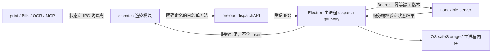
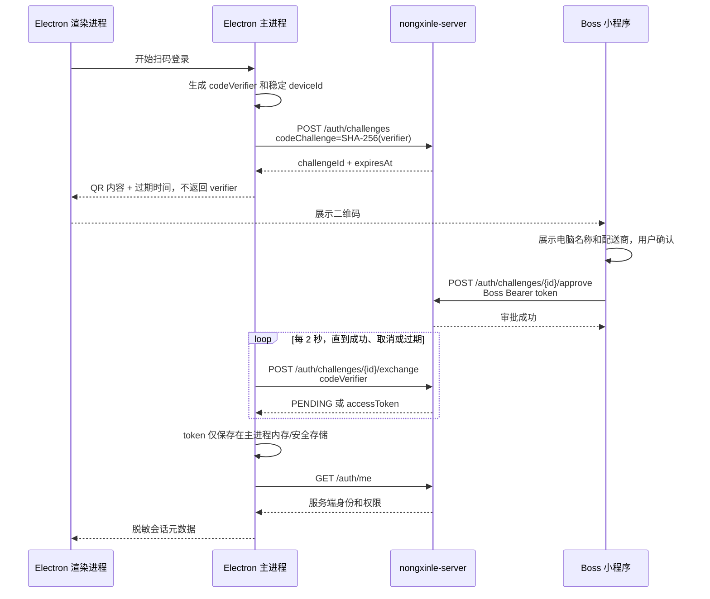

# 《Electron调度写操作接入方案》

## 1. 方案结论

Slice 2.1 只定义 Electron 接入服务端写操作的边界、协议和交互，不开发按钮，不修改服务端业务状态机。

推荐采用“主进程持有令牌、渲染进程只调用调度白名单”的结构：

- Electron 主进程负责一次性扫码、令牌加密保存、鉴权请求、幂等键和写请求发送。
- preload 只暴露明确命名的调度方法，不暴露 token、`ipcRenderer`、通用 HTTP 或任意 IPC channel。
- Vue 调度模块只保存登录状态、权限集合、命令执行状态和服务端快照，不保存明文 token。
- 所有业务判断仍由 `nongxinle-server` 完成。
- 写操作成功后重新读取服务端快照，不在 Electron 本地推进“分派中、装车中、配送中”。
- 打印用户、打印路由、打印配置和 MCP 会话与调度登录完全隔离。



## 2. Electron 登录流程

### 2.1 工作台进入策略

`/dispatch` 保持可以进入只读模式，不把调度登录变成整个 Electron 应用的全局登录，也不改变 `/bills` 和打印入口。

进入调度工作台时：

1. 渲染进程调用主进程的“读取调度会话状态”白名单方法。
2. 主进程尝试读取内存令牌；若用户允许在可信设备保留会话，再尝试使用 Electron `safeStorage` 解密本机密文。
3. 主进程携带 token 调用 `/api/desktop-dispatch/v1/auth/me`。
4. 服务端返回 `userId、disId、roleCode、permissions、expiresAt` 后，渲染进程只保存这些非敏感元数据。
5. 会话不存在或失效时，工作台继续只读展示，并显示“登录后可进行调度操作”。
6. 用户主动进入扫码登录流程后，才创建一次性挑战。

### 2.2 与现有打印身份的关系

现有根 Vuex 和 `localStorage` 中的 `disUser` 是打印/录单兼容身份，不能作为调度写权限凭据。

调度身份必须以 `/auth/me` 返回结果为准：

- 不把调度 token 写入 `localStorage`、Vuex 或页面组件。
- 不因为调度登录而自动修改根状态 `disUser`。
- 不复用“记住打印用户”开关保存调度 token。
- 若打印身份的 `disId` 与调度身份不一致，禁止写操作，提示用户当前工作台身份不一致。
- 身份不一致时不能自动切换打印用户，避免影响 Bills、打印队列和 MCP 打印上下文。
- 已登录调度状态下，调度模块读取数据应使用服务端认证身份对应的 `disId`；打印模块仍使用原有身份。

### 2.3 建议状态边界

后续实现时增加独立的调度认证状态，不进入打印模块：

```text
dispatchAuth（Vuex，仅内存）
├── status: anonymous | scanning | authenticated | expired | error
├── userId
├── disId
├── roleCode
├── permissions
├── expiresAt
└── challenge: challengeId / expiresAt / status

dispatchCommand（Vuex，仅内存）
├── actionType
├── status: idle | confirming | submitting | uncertain | succeeded | failed
├── idempotencyKey
├── requestId
├── errorCode
└── affectedResource
```

以上状态只描述界面和通信，不保存或推导服务端业务状态。

## 3. 一次性扫码流程

### 3.1 时序



### 3.2 二维码内容

二维码只包含：

- `challengeId`
- Electron 设备显示名称或设备摘要
- 挑战过期时间
- 固定协议版本

二维码禁止包含：

- `codeVerifier`
- access token
- 长期密钥
- `operatorUserId`
- 可直接调用写接口的凭据

### 3.3 扫码安全规则

- `codeVerifier` 由主进程使用加密安全随机数生成，只保存在主进程内存。
- 服务端只保存 verifier 哈希。
- 挑战默认 5 分钟过期，只能消费一次。
- Electron 每 2 秒尝试 exchange；`LOGIN_CHALLENGE_PENDING` 只表示等待，不显示为错误。
- 用户取消、窗口关闭或挑战过期时，主进程立即销毁 verifier。
- 同一窗口只允许一个活动挑战；重新生成二维码时废弃旧挑战。
- Boss 端必须显示设备信息并要求人工确认，不能“扫到即授权”。
- Boss 端审批接口必须使用 Boss 已登录的调度 token，不能通过二维码携带身份。

### 3.4 当前依赖

服务端挑战创建、审批和交换接口已经存在，但 Boss 小程序尚未提供桌面登录审批页面。该审批页面是 Electron 登录启用前的硬性依赖，不属于本 Slice 的开发范围。

## 4. Token 生命周期

### 4.1 保存位置

推荐优先级：

1. 主进程内存：始终保存当前明文 token。
2. Electron `safeStorage`：仅在用户明确选择“可信电脑，在有效期内保持登录”时保存密文。
3. 若 `safeStorage.isEncryptionAvailable()` 为 false：只使用内存会话，退出应用即清除；禁止降级为明文文件。

密文应保存在 Electron `userData` 下的独立调度凭据文件中，使用原子替换写入，并限制为当前系统用户访问。

禁止保存到：

- `localStorage`
- `sessionStorage`
- Vuex 持久化插件
- `.env`
- 日志
- 崩溃报告附加字段
- preload 可直接读取的对象

### 4.2 有效期策略

- 服务端当前 token 默认绝对有效 12 小时。
- Electron 以服务端 `expiresAt` 为准，本地提前 60 秒视为过期，避免时钟和网络边界问题。
- 到期前 10 分钟显示非阻断提示。
- 当前服务端没有 refresh token；到期后必须重新扫码，Electron 不自行续签。
- 每次应用启动、电脑唤醒、网络恢复后先调用 `/auth/me`，确认后才能写。
- 服务端 401 优先级高于本地时间判断；收到 401 立即清除内存和密文 token。
- 主动退出时先调用 `/auth/logout`，无论服务端是否可达，都必须清除本地凭据。
- 角色或配送商归属发生变化时，服务端会在请求时重新判断；客户端不能依赖登录时的旧权限。

### 4.3 共享电脑策略

- 默认建议只保留到应用退出。
- “保持登录”必须与“记住打印用户”分开设置。
- 应用进入系统锁屏或长时间无操作后，可以锁住调度写区域；解锁不得使用打印身份代替调度认证。

## 5. 权限失败处理

### 5.1 权限来源

- 登录完成后读取 `/auth/me`。
- 进入写工作区时读取 `/capabilities`。
- 页面只根据服务端返回的 permission 字符串决定按钮是否展示或禁用。
- Electron 不根据 `roleCode` 自行推导权限矩阵。
- 未识别的权限一律按无权限处理。
- 前端权限只用于界面提示，服务端校验始终是最终裁决。

### 5.2 状态码和错误码处理

| 返回 | Electron 行为 | 是否自动重试 |
| --- | --- | --- |
| 400 | 显示请求字段错误并定位对应输入 | 否 |
| 401 `UNAUTHENTICATED` | 清除 token，工作台降级只读，打开重新登录提示 | 否 |
| 403 `PERMISSION_DENIED` | 保留登录，重新读取 capabilities，禁用对应操作 | 否 |
| 404 `RESOURCE_NOT_FOUND` | 提示资源不存在或已不属于当前配送商，刷新快照 | 否 |
| 409 版本冲突 | 保留本地草案，刷新服务端数据，展示差异后要求用户重新确认 | 否 |
| 409 `COMMAND_IN_PROGRESS` | 保持提交中/结果待确认，不生成新幂等键 | 可查询结果，不重复创建命令 |
| 409 `IDEMPOTENCY_CONFLICT` | 视为客户端命令管理错误，停止提交并记录日志 | 否 |
| 422 `BUSINESS_RULE_REJECTED` | 原样展示安全的服务端业务提示，刷新相关快照 | 否 |
| 5xx | 显示服务暂不可用，保留原幂等键和原请求摘要 | 仅允许相同请求、相同幂等键重试 |
| 网络超时/断线 | 标记“结果待确认”，不能直接宣布失败 | 只能使用原幂等键核验 |

403 不能触发反复扫码；401 才表示会话需要重新建立。

## 6. 写接口调用规范

### 6.1 调用边界

后续写调用不得直接加入现有通用 Axios 拦截器。推荐由主进程建立独立的 `dispatchHttpClient`，只允许访问常量白名单：

- `/api/desktop-dispatch/v1/auth/**`
- `/api/desktop-dispatch/v1/capabilities`
- `/api/desktop-dispatch/v1/route-edits/preview`
- `/api/desktop-dispatch/v1/stops/confirm`
- `/api/desktop-dispatch/v1/route-edits/confirm`

preload 后续只允许暴露明确方法，例如：

```text
dispatchAuth.getSessionState()
dispatchAuth.beginQrLogin()
dispatchAuth.cancelQrLogin()
dispatchAuth.logout()
dispatchAuth.getCapabilities()

dispatchCommands.previewRouteEdit(payload)
dispatchCommands.confirmStop(payload, commandContext)
dispatchCommands.confirmRouteEdit(payload, commandContext)
```

不得暴露：

- `getToken()`
- `fetch(url, options)`
- `invoke(channel, payload)`
- 任意 URL
- 任意请求头
- 可访问打印、文件或系统命令的调度方法

所有 IPC handler 继续执行可信渲染进程来源校验，并对 DTO 字段、字符串长度、数组数量和请求体大小做限制。

### 6.2 请求头

主进程统一添加：

| 请求头 | 规则 |
| --- | --- |
| `Authorization` | 仅主进程添加，渲染进程不可读写 |
| `Idempotency-Key` | 每次新的用户确认生成 UUID；只用于落库命令 |
| `X-Request-Id` | 每次 HTTP 尝试生成新的 UUID，供链路排查 |
| `X-Client-Version` | Electron 包版本和构建号，不包含设备隐私 |
| `Content-Type` | `application/json` |

### 6.3 幂等键规则

- 用户第一次点击确认时生成一个幂等键。
- 双击、超时重试、网络重连核验必须沿用同一个幂等键和完全相同的请求内容。
- 用户修改司机、站点、顺序、原因或版本后，视为新命令，必须生成新幂等键。
- 收到明确成功或明确不可重试失败后，结束该幂等键生命周期。
- `replayed=true` 仍属于成功，UI 应提示“操作已完成，已核对重复提交”。
- 不允许 Axios 或通用重试插件给写请求自动生成新键。

### 6.4 版本规则

- `expectedTaskVersion` 和 `expectedRouteVersion` 必须来自最近一次服务端读取结果。
- 新任务或新路线按接口约定传 `0`。
- 版本缺失时禁止提交，不能猜测、不能默认为当前版本。
- 写成功后使用响应中的 `taskVersion/routeVersion` 更新短暂命令结果，随后立即重新读取正式快照。
- 版本冲突后不能自动覆盖，必须刷新并再次人工确认。

当前 Slice 1 的 Electron 只读模型没有明确消费 `taskVersion/routeVersion`，现有服务端 `pageViewModel` 也未确认对所有可写任务和路线输出版本。这是开放写按钮前的 P0 阻断项：

1. 服务端只读 DTO 必须为可写任务、路线返回稳定 ID 和版本。
2. Electron `readModel` 只做字段映射，不计算版本。
3. 缺少版本的资源只能只读。

增加版本字段属于读模型协议补充，不得修改业务状态机。

### 6.5 请求内容

- 不发送可信身份字段；即使兼容 DTO 中存在 `disId/operatorUserId`，服务端也必须覆盖。
- 只发送当前动作所需的 ID、站点顺序、理由和 expected version。
- 不发送前端推导的“司机可用”“路线合法”“下一状态”等结论。
- 路线预览只是服务端试算结果；确认接口仍需由服务端重新校验。
- 同一资源同一时间只允许一个落库命令，提交期间锁住相关操作区，防止双击。
- 不建立离线写队列，不在恢复网络后自动派单。

### 6.6 超时和崩溃恢复

写请求超时并不等于服务端失败。发生超时时：

1. 保留原幂等键和请求摘要。
2. UI 进入“结果待确认”而不是“失败”。
3. 先读取服务端最新快照。
4. 不使用新幂等键再次提交。

当前服务端没有按幂等键查询命令状态的只读接口。建议在真正开放写按钮前增加：

```text
GET /api/desktop-dispatch/v1/commands/{actionType}/{idempotencyKey}
```

该接口只允许当前配送商、当前操作人查询，返回 `PROCESSING/SUCCEEDED/NOT_FOUND` 和已脱敏结果。它只读取幂等记录，不修改业务状态机。

在该查询接口完成前，应用崩溃后的不确定命令只能通过最新业务快照和服务端审计人工核验，不能自动重放。

### 6.7 日志规范

允许记录：

- actionType
- requestId
- operationId
- HTTP 状态
- errorCode
- duration
- 是否 replay

禁止记录：

- access token
- Authorization
- codeVerifier
- 完整二维码内容
- 完整商品、客户或路线 payload
- 未脱敏服务端响应

## 7. 操作成功 UI 反馈

### 7.1 提交过程

- 用户点击确认后进入明确的二次确认区，展示服务端已有数据摘要，不展示客户端推导结论。
- 提交期间只锁住受影响的司机、任务或路线操作区，不阻塞打印中心。
- 按钮文案改为“正在提交”，并防止重复点击。
- 超过正常响应时间后显示“正在确认服务端结果”，不能显示“已失败”。

### 7.2 明确成功

只有同时满足以下条件才显示成功：

- HTTP 2xx。
- 响应 envelope 成功。
- 返回操作结果。

成功反馈：

1. 显示短暂成功提示。
2. 保存 `requestId/operationId` 供详情查看。
3. 清除本次本地编辑草案。
4. 重新读取分派、装车、配送、司机列表等相关服务端快照。
5. 根据刷新后的服务端数据更新界面，不在本地手工移动订单或推进阶段。

若写操作已成功但刷新失败，应显示：

> 操作已成功，最新数据暂未读取，请点击刷新。

此时只能重试读取，不能再次调用写接口。

### 7.3 幂等重放成功

服务端返回 `replayed=true` 时：

- 按成功处理。
- 提示“该操作此前已完成，系统已核对结果”。
- 重新读取服务端快照。
- 不再生成新命令。

## 8. 操作失败 UI 反馈

### 8.1 展示层级

失败信息分三层：

1. 操作区内联提示：说明本次动作为什么不能继续。
2. 顶部状态提示：说明是否需要登录、刷新或联系管理员。
3. “查看详情”：展示 `errorCode、requestId、发生时间`，不展示 token 和完整 payload。

### 8.2 典型反馈

- 401：`登录已过期，工作台已切换为只读。重新登录后请重新检查数据。`
- 403：`当前账号没有此操作权限。权限已重新同步。`
- 409 版本冲突：`路线已被其他人更新。已保留你的调整，请刷新对比后重新确认。`
- 409 处理中：`请求正在服务端处理中，请勿重复提交。`
- 422：展示服务端返回的可读业务原因。
- 网络不确定：`网络中断，操作结果尚未确认。系统不会重复派单。`
- 5xx：`服务暂不可用。可使用原请求继续核验，错误编号：requestId。`

### 8.3 本地草案处理

- 401、403、409、422 和网络错误时不立即清除路线调整草案。
- 刷新后把服务端新版本与草案并列展示，由用户决定放弃或重新编辑。
- 不自动把旧草案套用到新版本并提交。
- 用户改变草案后必须创建新的幂等键并重新确认。

## 9. 模块隔离建议

后续实现建议新增以下文件，不改动打印模块目录：

```text
src/
└── dispatch/
    ├── dispatch-auth-session.js
    ├── dispatch-credential-store.js
    ├── dispatch-http-client.js
    └── dispatch-ipc.js

vue/src/modules/dispatch/
├── api/
│   ├── dispatchReadApi.js
│   └── dispatchWriteGateway.js
├── auth/
│   └── store.js
├── commands/
│   ├── store.js
│   └── commandCoordinator.js
└── components/
    └── auth-and-feedback-components
```

preload 只追加调度白名单对象，不改变现有打印方法名、参数或事件监听。

## 10. 开发前硬性验收项

在进入按钮开发前，必须确认：

1. 测试数据库已经执行 Slice 2.0 迁移。
2. Boss 小程序具备扫码后展示设备信息、人工确认、调用 approve 接口的能力。
3. 所有可写任务和路线的只读模型都返回稳定 ID 与 version。
4. `/auth/me` 和 `/capabilities` 的字段协议固定。
5. 明确 Electron 的 API baseURL 配置来源，不允许渲染进程任意覆盖。
6. 主进程 `safeStorage` 不可用时采用内存会话，确认不明文降级。
7. 401、403、409、422、5xx 和超时场景完成测试用例设计。
8. 服务端提供命令状态查询接口，或明确接受崩溃后只能人工核验的限制。
9. 打印、Bills、OCR、MCP 的现有回归基线已经固定。
10. 通过评审后再开发登录界面和写按钮。

## 11. 本 Slice 不实施的内容

- 不新增或修改 Electron 按钮。
- 不调用派单写接口。
- 不改动打印、Bills、OCR、MCP。
- 不改动 `nongxinle-server` 业务状态机。
- 不在 Electron 实现司机可用性、路线合法性、状态推进或异常处理规则。
- 不把调度 token 放入现有打印用户持久化逻辑。

