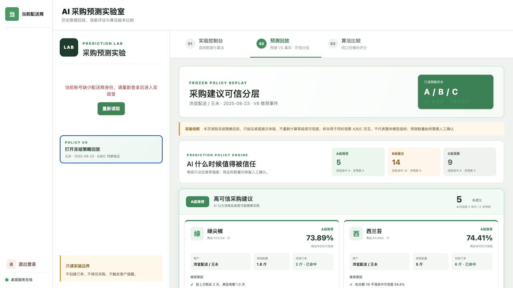
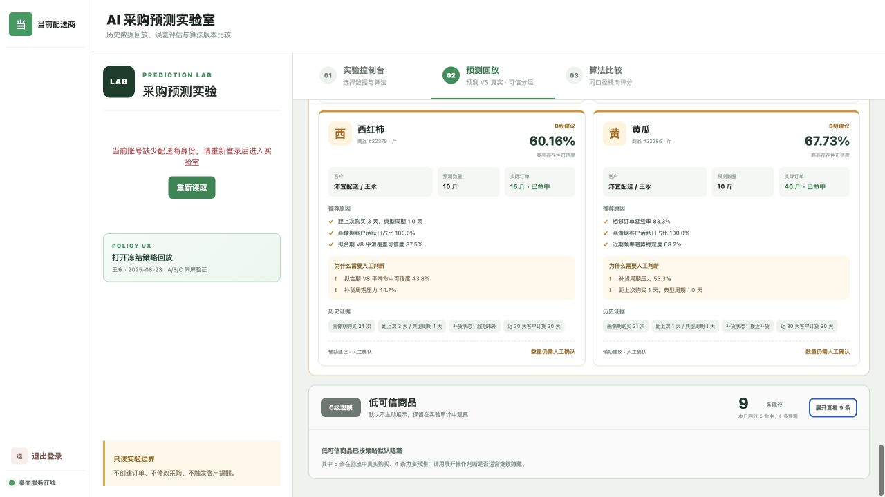
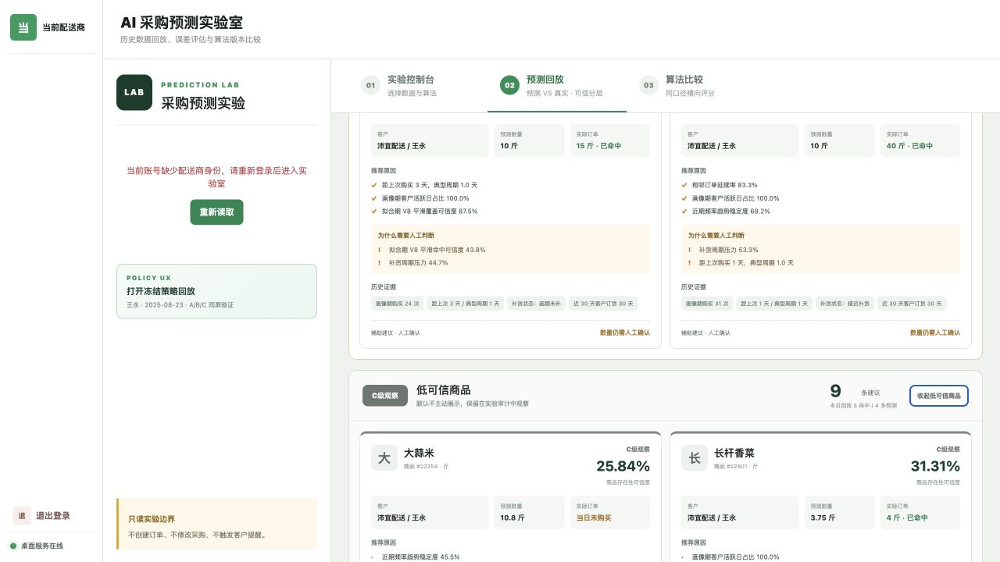

# Prediction Policy Engine 桌面端不修改算法验证报告

## 1. 验证结论

Prediction Lab 已增加 A/B/C 可信等级的只读桌面展示，并用冻结真实饭馆样本完成页面验收。

本阶段没有修改：

- V6 客户订货判断；
- V7 商品候选体系；
- V8 补货状态、动态关联或数量公式；
- Customer Relationship Profile；
- Product Predictability Profile；
- Prediction Policy Engine 模型、特征、参数或等级边界；
- `nongxinle-server` 接口；
- 订单、采购、提醒、打印、派单或 `shop-mini`。

## 2. 桌面端新增内容

```text
冻结 Policy 回放 JSON
        ↓
只读展示适配器（精确匹配，不计算）
        ↓
A/B/C 分组
        ↓
可信分 + 原因 + 风险 + 历史证据
        ↓
预测数量 + 回放实际结果 + 人工确认提示
```

独立“打开冻结策略回放”入口可以在 Server 未启动或当前账号没有配送商身份时进行 UX 验证。在线 V8 结果只有与冻结配送商、客户、日期、算法和商品 ID 完全匹配时才附加策略字段。

## 3. 冻结证据

| 项目 | 值 |
|---|---|
| 源合同 | `prediction-lab-policy-engine-decision-replay/v1` |
| 源 SHA-256 | `4174879902a3e888fd2d2ab4437d691e79a126fede4c0ff624315abd27eb8ac3` |
| 配送商 | 56，沛宜配送 |
| 客户 | 120，王永 |
| 日期 | 2025-08-23 |
| 推荐事件 | 28 |
| A/B/C | 5 / 14 / 9 |
| 用途 | 桌面 UX 验证，不代替总体模型评价 |

生成脚本在输出前检查源 SHA-256 和 A/B/C 数量；源文件变化会直接失败，不会静默生成新样本。

## 4. 页面验收

已验证：

- A、B 默认展开；
- C 默认折叠；
- C 可以人工展开和再次收起；
- 每张卡片显示客户、商品、等级、可信度、推荐原因、历史证据、预测数量和回放实际结果；
- B/C 显示“为什么需要人工判断”；
- 每张卡片固定显示“数量仍需人工确认”；
- 页面明确标注冻结、只读、不重算等级和样本非总体指标；
- 浏览器运行日志无页面错误。

## 5. 工程验证

```text
npm run generate:prediction-policy-fixture
npm run test:prediction-policy-ui
npm run build:vue
```

同时继续执行现有 ProductShell、只读边界和安全冒烟测试，防止本模块侵入打印、订单或调度架构。

本次实际结果：

| 验证 | 结果 | 说明 |
|---|---|---|
| `test:prediction-policy-ui` | 通过 | 冻结/只读、28 条事件、A/B/C、原因、证据、默认折叠、人工确认均通过 |
| `test:slice0` | 通过 | 模块、路由、打印隔离、调度只读边界通过 |
| `build:vue` | 通过 | Vite 生产构建完成；仅保留项目既有大分包警告 |
| 浏览器交互 | 通过 | 冻结入口、A/B 展开、C 展开/收起、字段显示；控制台无页面错误 |
| `test:product-shell` | 既有基线失败 | 脚本仍期待已经不存在的 `OrderIntake`、`OrderTasks` 两个旧侧栏项；本轮未修改导航 |
| `test:slice1` | 既有基线失败 | 脚本仍期待旧调度三栏选择器；本轮未修改调度工作台 |

后两项与 Prediction Policy 展示文件无重叠，本阶段不越界修改订单导航或调度布局。

## 6. 截图

### A/B/C 概览与 A 级卡片



### C 级默认折叠



### C 级人工展开



## 7. 当前边界

该页面是实验展示，不是采购工作台。没有任何确认按钮会写订单或采购单，也没有把 Level A 转换为自动化权限。是否进入下一阶段，必须先由真实采购员验证推荐理由、数量调整成本、B 级帮助程度和 C 级隐藏策略。
